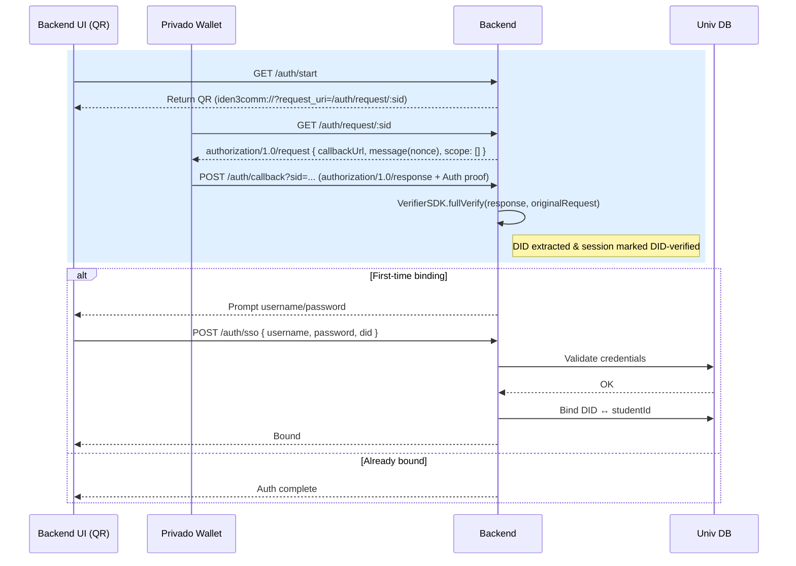
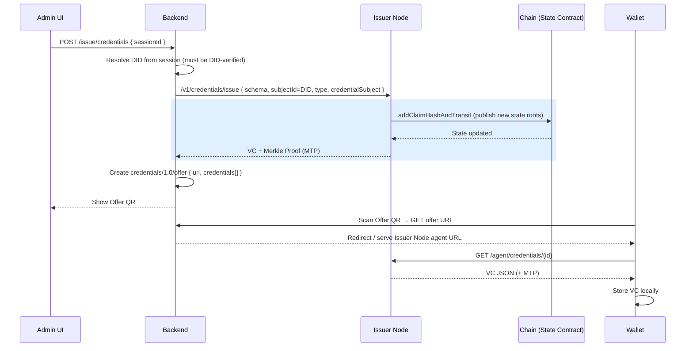
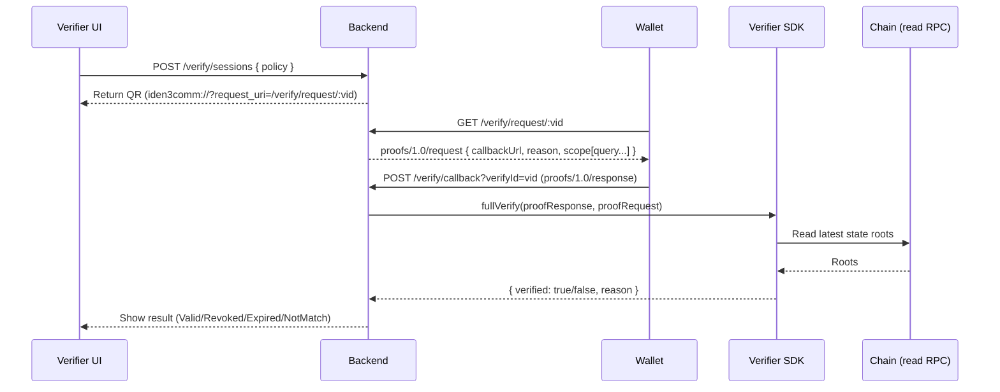

# Privado ID–based Degree Certificate System
**Design & Implementation Spec**

> **Scope**
> - Backend == the university (no third party).
> - Reuse **Privado ID Wallet** (Holder) + **Issuer Node**.
> - Issuance: **On‑chain Merklized Issuer**. See [Privado ID on‑chain issuer](https://docs.privado.id/docs/issuer/on-chain-issuer/on-chain-overview)
> - Verification: **Off‑chain** with Verifier SDK. See [Privado ID off‑chain verification](https://docs.privado.id/docs/verifier/verification-library/verifier-library-intro)
> - **Iden3comm‑compatible** Auth/Verify APIs (QR payloads + callbacks).
> - Student identity auth = **standard Privado ID Auth** + **simple username/password** (first‑time binding).

---

## 0. Technical Background
- Decentralized ID (**DID**) proves control via cryptographic Auth proof; a Verifiable Credential (**VC**) is a signed JSON held locally by the wallet.
- **Issuer Node** merklizes claims and updates on‑chain **state roots**; no VC plaintext on chain.
- **Iden3comm** defines the **standard** message shapes for Auth/Offer/Proof (QR + callback).
- **Off‑chain verification** uses Verifier SDK and reads the latest state from the chain via RPC.

**Privado ID** provides the platform for DID, issuing VC, holding (wallet) and verification. We only add our business logic on top.

Developers should at least understand:
- [Background knowledge](./background-knowledge.md)
- [Privado ID on‑chain issuer](https://docs.privado.id/docs/issuer/on-chain-issuer/on-chain-overview)
- [Privado ID off‑chain verification](https://docs.privado.id/docs/verifier/verification-library/verifier-library-intro)

---

## 1. Actors & Responsibilities

| Role | Responsibilities |
|------|------------------|
| **Holder (Privado Wallet)** | Scan QR; perform DID Auth; store VC locally; generate ZK proofs. |
| **Backend (University)** | Auth (DID + first‑time username/password); Issue (call Issuer Node; Offer QR); Verify (proof request + off‑chain validation). |
| **Issuer Node** | Merklized issuance; publish state roots to chain; return VC + MTP. |
| **Blockchain** | Stores state roots (claims/revocation/root‑of‑roots). |

---

## 2. Deployment & Configuration

### 2.1 Backend Environment

Example:
```env
NETWORK=amoy
RPC_URL=https://rpc-amoy.polygon.technology
STATE_CONTRACT=0x134B1BE34911E39A8397EC6289782989729807a4

ISSUER_NODE_BASE=https://issuer.school.edu
ISSUER_DID=did:polygonid:polygon:amoy:0xYourIssuerIdentity

BACKEND_BASE=https://school.edu
SESSION_TTL_MIN=15
VERIFY_SESSION_TTL_MIN=10
```

### 2.2 Issuer DID
- Generate/import the **Issuer DID** (school identity).
- Configure Issuer Node to sign as that DID.
- Share Issuer DID so verifiers can set `allowedIssuers`.

### 2.3 Schema
- Host `DegreeCredential` schema (IPFS/HTTPS). Wallets and Issuer Node reference this in issuance and proof queries.

### 2.4 Verifier SDK
- Initialize a **StateResolver** with `(RPC_URL, STATE_CONTRACT)`; support multi‑network if needed.

---

## 3. End‑to‑End User Stories

### Story A — Student receives a degree credential
1) Student opens **Auth** page, scans QR; wallet performs **DID Auth** → callback.
2) First time only, backend shows **username/password** form; binds `{studentId ↔ DID}`.
3) Admin triggers **Issue**: backend calls Issuer Node with `subjectId=DID` → gets VC + MTP → renders **Offer** QR.
4) Wallet retrieves VC and stores locally (encrypted).

### Story B — Third‑party verification (off‑chain)
1) Verifier page creates a **verification session** → shows **Proof Request** QR.
2) Wallet posts **proofs/response** to callback.
3) Backend uses Verifier SDK; checks state roots → shows result (Valid/Revoked/Expired).

---

Note:
- For the standard part, the [official demo codebase](https://github.com/0xPolygonID/onchain-merklized-issuer-demo) can be referred to.
- The standard parts are marked with a special color in the sequence graph.

## 4. Authentication Flow (DID + first‑time username/password)

> **STANDARD parts**: Iden3comm **authorization/1.0/request → response**, wallet callback, and off‑chain verify of Auth proof.

### 4.1 Sequence Graph



### 4.2 APIs (Auth)

**GET `/api/v1/requests/auth?issuer={issuerDID}`**
- Creates a new authentication session
- Returns: **authorization/1.0/request** message (iden3comm standard)
- Response headers: `x-id: {sessionId}` (session identifier)
- Response body: Authorization request QR code data
  ```json
  {
    "id": "uuid",
    "typ": "application/iden3comm-plain-json",
    "type": "https://iden3-communication.io/authorization/1.0/request",
    "thid": "uuid",
    "body": {
      "callbackUrl": "https://backend/api/v1/callback?sessionId={sessionId}",
      "reason": "login to website",
      "scope": []
    },
    "from": "{issuerDID}"
  }
  ```

**POST `/api/v1/callback?sessionId={sessionId}`**
- Wallet callback endpoint (iden3comm standard)
- Receives: **authorization/1.0/response** with Auth proof (JWZ token)
- Backend calls `Verifier.FullVerify()` to validate proof
- In DEMO_MODE: Skips verification and returns demo DID
- In production: Validates ZKP proof against blockchain
- Returns: `{ id: "did:iden3:..." }` (verified DID)

**GET `/api/v1/status?id={sessionId}`**
- Polls authentication status
- Returns: `{ id: "did:iden3:..." }` if authenticated
- Returns: 404 if not yet authenticated

### 4.3 How issuing receives “auth context”
- Backend session keeps `{ did, didVerified:true, verifiedAt, studentId? }` after Auth callback.
- Issuing endpoint receives a `sessionId` from UI; backend **resolves** it to the DID and includes it as `subjectId` in the Issuer Node `/v1/credentials/issue` call.
- The session id itself can be recorded as `authContextId` in the issuance audit row to link “who was authenticated” when issuing occurred.

---

## 5. Issuing Flow (On‑chain Merklized)

> **STANDARD parts**: Issuer Node merklized flow and on‑chain state update; wallet Offer consumption.

### 5.1 Sequence Graph



### 5.2 Issuer Node request (example)
```http
POST {ISSUER_NODE_BASE}/v1/credentials/issue
Content-Type: application/json

{
  "schema": "ipfs://QmSchemaHash",
  "subjectId": "did:polygonid:holder...",
  "type": ["VerifiableCredential", "DegreeCredential"],
  "credentialSubject": {
    "university": "ABC University",
    "degree": "BSc",
    "major": "Computer Science",
    "graduationYear": 2025
  },
  "expiration": "2027-12-31T23:59:59Z",
  "revocationNonce": 1234567
}
```

### 5.3 Offer (QR payload)
```json
{
  "type": "https://iden3-communication.io/credentials/1.0/offer",
  "body": {
    "url": "https://issuer.school.edu/api/credentials/abcd-1234",
    "credentials": [
      { "type": ["VerifiableCredential", "DegreeCredential"], "schema": "ipfs://QmSchemaHash" }
    ]
  }
}
```

---

## 6. Verification Flow (Off‑chain)

> **STANDARD parts**: Iden3comm Proof Request/Response and off‑chain `VerifierSDK.fullVerify(...)` + state resolver.

### 6.1 Sequence Graph



### 6.2 Proof Request (QR payload)
```json
{
  "type": "https://iden3-communication.io/proofs/1.0/request",
  "body": {
    "callbackUrl": "https://school.edu/verify/callback?verifyId=uuid",
    "reason": "Verify degree authenticity",
    "scope": [{
      "query": {
        "allowedIssuers": ["did:polygonid:issuer123"],
        "type": "DegreeCredential",
        "credentialSubject": {
          "university": { "$eq": "ABC University" }
        }
      }
    }]
  }
}
```

### 6.3 Wallet Callback (STANDARD)
```json
{
  "proof": {
    "type": "zkProofV2",
    "pub_signals": ["..."],
    "proof": { "pi_a":[], "pi_b":[], "pi_c":[] }
  },
  "did": "did:polygonid:..."
}
```


---

## 7. API Surface

### 7.1 Auth

**GET `/api/v1/requests/auth?issuer={issuerDID}`**
- Creates authentication session and returns QR code data
- Response headers: `x-id: {sessionId}`
- Response body: **authorization/1.0/request** message

**POST `/api/v1/callback?sessionId={sessionId}`**
- Wallet callback with auth proof
- In DEMO_MODE: Skips verification
- In production: Validates ZKP proof against blockchain
- Returns: `{ id: "did:iden3:..." }`

**GET `/api/v1/status?id={sessionId}`**
- Polls authentication status
- Returns: `{ id: "did:iden3:..." }` if authenticated
- Returns: 404 if pending

### 7.2 Issue

**GET `/api/v1/issuers`**
- Returns list of available issuers (DIDs configured in backend)
- Response: Array of issuer DID strings

**POST `/api/v1/identities/{issuerDID}/claims`**
- Creates and issues a credential on-chain
- Request body:
  ```json
  {
    "credentialSchema": "http://backend/schemas/degree-credential-schema.json",
    "type": "DegreeCredential",
    "credentialSubject": {
      "id": "did:iden3:privado:test:...",  // Subject DID (holder)
      "university": "Arizona State University",
      "degree": "Bachelor of Science",
      "major": "Computer Science",
      "graduationYear": 2025
    },
    "expiration": 1735689599,  // Unix timestamp (optional)
    "revNonce": 123456  // Revocation nonce (optional)
  }
  ```
- Backend calls blockchain to publish state root via `addClaimHashAndTransit()`
- Returns: `{ id: "{claimId}" }` (credential record ID)

**GET `/api/v1/identities/{issuerDID}/claims?subject={holderDID}&schemaType={type}`**
- Retrieves all credentials for a specific subject
- Query params: `subject` (holder DID), `schemaType` (credential type)
- Returns: Array of credential objects

**GET `/api/v1/identities/{issuerDID}/claims/{claimId}`**
- Retrieves a specific credential by ID
- Returns: Full W3C Verifiable Credential JSON-LD

**GET `/api/v1/identities/{issuerDID}/claims/offer?claimId={id}&subject={holderDID}`**
- Generates credential offer QR code data
- Returns: **credentials/1.0/offer** message (iden3comm standard)
  ```json
  {
    "id": "uuid",
    "thid": "uuid",
    "typ": "application/iden3comm-plain-json",
    "type": "https://iden3-communication.io/credentials/1.0/offer",
    "body": {
      "url": "https://backend/api/v1/agent",
      "credentials": [{
        "id": "{claimId}",
        "description": "DegreeCredential"
      }]
    },
    "from": "{issuerDID}",
    "to": "{holderDID}"
  }
  ```

**POST `/api/v1/agent`**
- Iden3comm agent endpoint (iden3comm standard)
- Wallet fetches credential here after scanning offer QR code
- Handles credential fetch protocol
- Returns: W3C Verifiable Credential + Merkle proof

**GET `/api/v1/identities/{issuerDID}/claims/revocation/status/{nonce}`**
- Checks if a credential is revoked
- Returns: `{ mtp: { existence: true/false } }`

**POST `/api/v1/identities/{issuerDID}/claims/revoke/{nonce}`**
- Revokes a credential by nonce
- Publishes revocation to blockchain
- Returns: 202 Accepted

### 7.3 Verify (Off‑chain)

**POST `/api/v1/verification/request`**
- Creates a new verification session with selective disclosure support
- Request body:
  ```json
  {
    "credentialType": "DegreeCredential",
    "schemaUrl": "http://backend/schemas/degree-credential-schema.json",
    "query": {
      "graduationYear": { "$gt": 2020 }  // ZK proof without revealing exact value
    },
    "disclose": ["name", "degree", "university"]  // Reveal these fields
  }
  ```
- Query operators supported: `$eq`, `$gt`, `$lt`, `$in`, `$nin`, `$ne`
- Response headers: `x-id: {sessionId}` (session identifier)
- Response body: **authorization/1.0/request** message with ZKP query
  ```json
  {
    "id": "uuid",
    "typ": "application/iden3comm-plain-json",
    "type": "https://iden3-communication.io/authorization/1.0/request",
    "thid": "uuid",
    "body": {
      "callbackUrl": "https://backend/api/v1/verification/callback?sessionId={sessionId}",
      "reason": "Verify your DegreeCredential credential",
      "scope": [{
        "id": 1,
        "circuitId": "credentialAtomicQueryMTPV2OnChain",
        "query": {
          "allowedIssuers": ["*"],
          "context": "http://backend/schemas/degree-credential-schema.json",
          "type": "DegreeCredential",
          "credentialSubject": {
            "graduationYear": { "$gt": 2020 },
            "name": {},
            "degree": {},
            "university": {}
          }
        }
      }]
    }
  }
  ```

**POST `/api/v1/verification/callback?sessionId={sessionId}`**
- Wallet callback endpoint (iden3comm standard)
- Receives: JWZ token (JSON Web Zero-knowledge) containing ZKP proof
- **ALWAYS validates against blockchain** (no DEMO_MODE bypass):
  - Validates JWZ token cryptography
  - Verifies ZKP proof (Groth16)
  - Checks GIST root exists on blockchain
  - Validates GIST root freshness (< 15 min if replaced)
  - Verifies query conditions are met
- Returns: `{ status: "verified", did: "did:iden3:..." }` if valid
- Returns: 401 Unauthorized if proof is invalid

**GET `/api/v1/verification/status?id={sessionId}`**
- Polls verification status (frontend calls every 2 seconds)
- Returns: `{ status: "verified", did: "did:iden3:..." }` if completed
- Returns: 404 Not Found if pending or session not found

---

## 8. Data Model & Storage

| Table | Key Fields | Notes |
|------|------------|-------|
| **users** | studentId (PK), name, email | University directory |
| **did_bindings** | id (PK), studentId (FK), did (unique), status, bound_at | First‑time binding only |
| **sessions** | sid (PK), did, didVerified, studentId?, createdAt, expiresAt | For Auth & Issue |
| **issue_records** | claimId, did, schema, revNonce, stateRoot, txHash, createdAt | Issuance audit |
| **verify_sessions** | verifyId, policy, status, proof?, result?, createdAt, expiresAt | Off‑chain verify |

**Data residency:** VC plaintext remains in the **wallet only**. Backend stores minimal metadata and proofs transiently.

## 9. Frontend Integration

The UI should have entry points for issuing and verification.

### 9.1 Authentication Flow (Step 1 for Issuing)

**User Story:** Student authenticates their DID before receiving credentials

**Frontend Flow:**
1. Page loads → Call `GET /api/v1/requests/auth?issuer={issuerDID}`
2. Display QR code from response body
3. Start polling `GET /api/v1/status?id={sessionId}` (from `x-id` header) every 2 seconds
4. When status returns `{ id: "did:iden3:..." }` → Authentication complete
5. Store the authenticated DID for issuing

**Example Code:**
```javascript
// Step 1: Create auth session
const authResponse = await fetch('/api/v1/requests/auth?issuer=did:iden3:...');
const sessionId = authResponse.headers.get('x-id');
const qrData = await authResponse.json();

// Step 2: Display QR code
displayQRCode(qrData);

// Step 3: Poll for authentication
const pollAuth = setInterval(async () => {
  const statusResponse = await fetch(`/api/v1/status?id=${sessionId}`);
  if (statusResponse.ok) {
    const { id: userDID } = await statusResponse.json();
    clearInterval(pollAuth);
    onAuthSuccess(userDID);
  }
}, 2000);
```

### 9.2 Issuing Process

**User Story:** Student receives their degree credential after authentication

**Frontend Flow:**
1. Prerequisites: Student must be authenticated (DID known from step 9.1)
2. Display student's degree information (fetch from university database)
3. User clicks "Issue Degree Certificate" button
4. Call `POST /api/v1/identities/{issuerDID}/claims` with credential data
5. Get `claimId` from response: `{ id: "{claimId}" }`
6. Call `GET /api/v1/identities/{issuerDID}/claims/offer?claimId={id}&subject={holderDID}`
7. Display offer QR code from response
8. Student scans QR code with Polygon ID wallet
9. Wallet automatically fetches credential from `/api/v1/agent` endpoint
10. Show success message

**Example Code:**
```javascript
// Step 1: Issue credential on-chain
const issuerDID = 'did:iden3:privado:test:...';
const holderDID = authenticatedUserDID; // From auth flow

const credentialRequest = {
  credentialSchema: 'http://backend/schemas/degree-credential-schema.json',
  type: 'DegreeCredential',
  credentialSubject: {
    id: holderDID,
    university: 'Arizona State University',
    degree: 'Bachelor of Science',
    major: 'Computer Science',
    graduationYear: 2025
  },
  expiration: Math.floor(new Date('2027-12-31').getTime() / 1000)
};

const issueResponse = await fetch(
  `/api/v1/identities/${issuerDID}/claims`,
  {
    method: 'POST',
    headers: { 'Content-Type': 'application/json' },
    body: JSON.stringify(credentialRequest)
  }
);
const { id: claimId } = await issueResponse.json();

// Step 2: Get credential offer
const offerResponse = await fetch(
  `/api/v1/identities/${issuerDID}/claims/offer?claimId=${claimId}&subject=${holderDID}`
);
const offerQRData = await offerResponse.json();

// Step 3: Display offer QR code
displayQRCode(offerQRData);
```

**Current Status:** ✅ Issuing UI is finished

**Future Enhancement:** Add student ID login (e.g., MyASU login) after authentication to link DID ↔ studentId

### 9.3 Verification Process

**User Story:** Verifier requests and validates a student's degree credential with selective disclosure

**Frontend Flow:**
1. Verifier opens verification UI (no login required)
2. Build verification query:
   - Select credential type (e.g., "DegreeCredential")
   - Specify query conditions (e.g., graduationYear > 2020) - ZK proof without revealing exact value
   - Select fields to disclose (e.g., name, degree, university) - reveal actual values
3. User clicks "Request Degree Certificate" button
4. Call `POST /api/v1/verification/request` with verification requirements
5. Get `sessionId` from `x-id` header and QR code data from response body
6. Display verification QR code
7. Start polling `GET /api/v1/verification/status?id={sessionId}` every 2 seconds
8. Student scans QR code → Wallet generates ZKP proof → Posts to callback
9. When status returns `{ status: "verified", did: "..." }` → Verification complete
10. Display verification result (Pass/Fail with verified DID)

**Example Code:**
```javascript
// Step 1: Create verification request with selective disclosure
const verificationRequest = {
  credentialType: 'DegreeCredential',
  schemaUrl: 'http://backend/schemas/degree-credential-schema.json',
  query: {
    graduationYear: { $gt: 2020 }  // Prove graduation year > 2020 without revealing exact year
  },
  disclose: ['name', 'degree', 'university']  // Reveal these fields
};

const verifyResponse = await fetch('/api/v1/verification/request', {
  method: 'POST',
  headers: { 'Content-Type': 'application/json' },
  body: JSON.stringify(verificationRequest)
});

const sessionId = verifyResponse.headers.get('x-id');
const qrData = await verifyResponse.json();

// Step 2: Display verification QR code
displayQRCode(qrData);

// Step 3: Poll for verification result
const pollVerification = setInterval(async () => {
  const statusResponse = await fetch(`/api/v1/verification/status?id=${sessionId}`);

  if (statusResponse.ok) {
    const { status, did } = await statusResponse.json();
    clearInterval(pollVerification);

    // Verification succeeded
    displayVerificationResult({
      status: 'Pass',
      verifiedDID: did,
      message: 'Credential verified successfully!'
    });
  } else if (statusResponse.status === 401) {
    // Verification failed
    clearInterval(pollVerification);
    displayVerificationResult({
      status: 'Fail',
      message: 'Credential verification failed'
    });
  }
  // 404 = still pending, continue polling
}, 2000);
```

**Query Builder UI:**
- Similar to [Privado ID Query Builder](https://tools.privado.id/query-builder/)
- For this demo: Simple table for specifying:
  - **Query conditions** (ZK proof): graduationYear, GPA, etc.
  - **Disclosed fields** (reveal): name, degree, university, etc.
  - **Operators**: `$eq`, `$gt`, `$lt`, `$in`, `$nin`, `$ne`. We can hard-code it rather than allow the verifier specifies.

---

## 10. Security & Ops

- Nonce binding, session TTLs, short‑lived verification sessions.
- Whitelist **Issuer DID** on verifier queries.
- Always read **latest state roots** before judging a proof.
- No VC plaintext on backend or chain.
- Audit with IDs/hashes only; avoid PII in logs.

---

## 11. STANDARD vs Custom (at a glance)

**STANDARD**: Iden3comm message shapes (Auth/Offer/Proof), wallet callbacks, Issuer Node merklized issuance + state update, Verifier SDK `fullVerify(...)`.
**Custom**: First‑time username/password binding, UI, orchestration, and minimal persistence.
