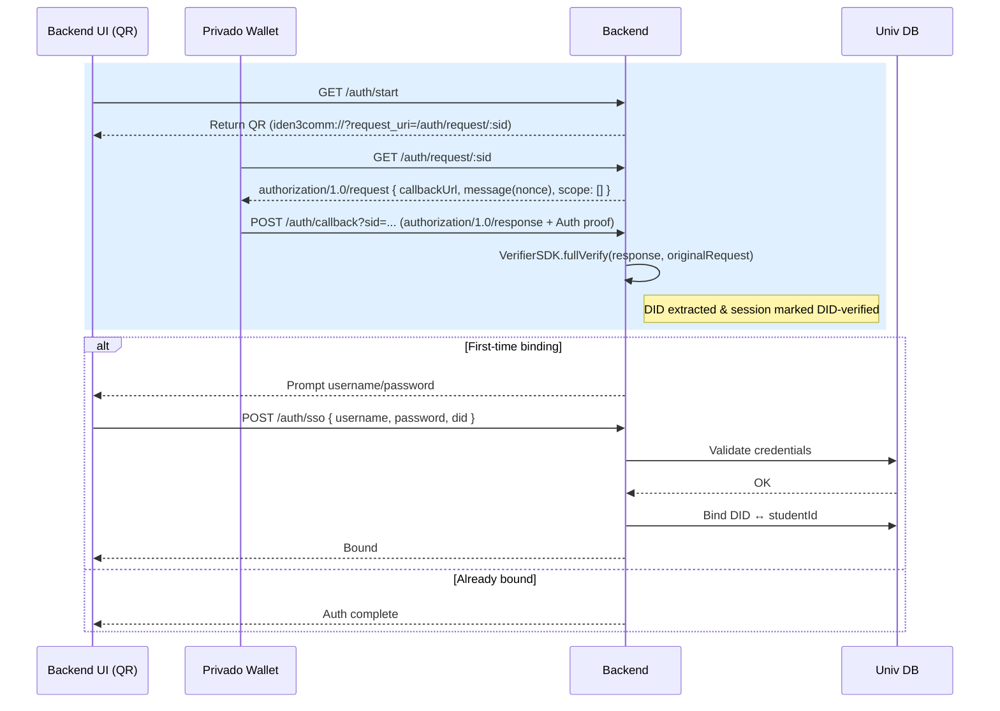
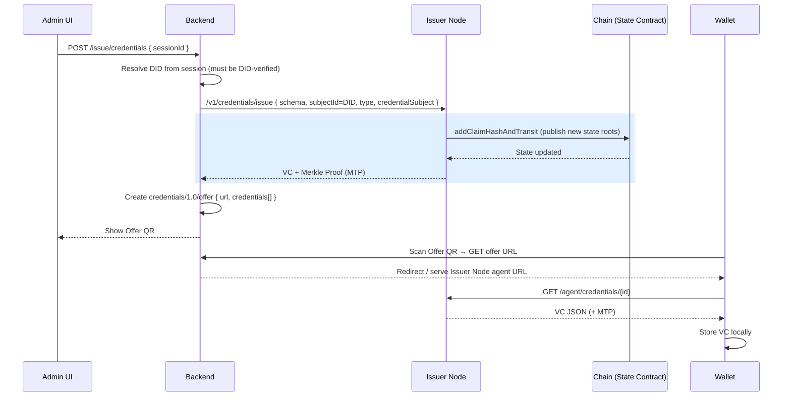
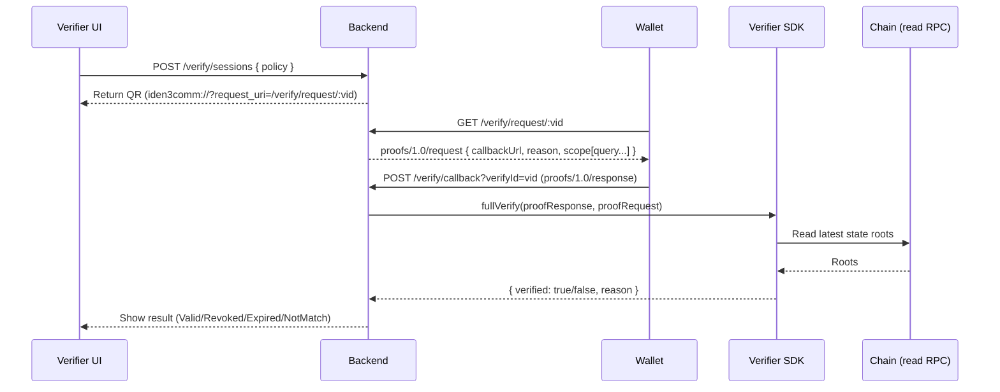

# Privado ID–based Degree Certificate System
**Design & Implementation Spec**

> **Scope**
> - Backend == the university (no third party).
> - Reuse **Privado ID Wallet** (Holder) + **Issuer Node**.
> - Issuance: **On‑chain Merklized Issuer**. See [Privado ID on‑chain issuer](https://docs.privado.id/docs/issuer/on-chain-issuer/on-chain-overview)
> - Verification: **Off‑chain** with Verifier SDK. See [Privado ID off‑chain verification](https://docs.privado.id/docs/verifier/verification-library/verifier-library-intro)
> - **Iden3comm‑compatible** Auth/Verify APIs (QR payloads + callbacks).
> - Student identity auth = **standard Privado ID Auth** + **simple username/password** (first‑time binding).

---

## 0. Technical Background
- Decentralized ID (**DID**) proves control via cryptographic Auth proof; a Verifiable Credential (**VC**) is a signed JSON held locally by the wallet.
- **Issuer Node** merklizes claims and updates on‑chain **state roots**; no VC plaintext on chain.
- **Iden3comm** defines the **standard** message shapes for Auth/Offer/Proof (QR + callback).
- **Off‑chain verification** uses Verifier SDK and reads the latest state from the chain via RPC.

**Privado ID** provides the platform for DID, issuing VC, holding (wallet) and verification. We only add our business logic on top.

Developers should at least understand:
- [Background knowledge](./background-knowledge.md)
- [Privado ID on‑chain issuer](https://docs.privado.id/docs/issuer/on-chain-issuer/on-chain-overview)
- [Privado ID off‑chain verification](https://docs.privado.id/docs/verifier/verification-library/verifier-library-intro)

---

## 1. Actors & Responsibilities

| Role | Responsibilities |
|------|------------------|
| **Holder (Privado Wallet)** | Scan QR; perform DID Auth; store VC locally; generate ZK proofs. |
| **Backend (University)** | Auth (DID + first‑time username/password); Issue (call Issuer Node; Offer QR); Verify (proof request + off‑chain validation). |
| **Issuer Node** | Merklized issuance; publish state roots to chain; return VC + MTP. |
| **Blockchain** | Stores state roots (claims/revocation/root‑of‑roots). |

---

## 2. Deployment & Configuration

### 2.1 Backend Environment

Example:
```env
NETWORK=amoy
RPC_URL=https://rpc-amoy.polygon.technology
STATE_CONTRACT=0x134B1BE34911E39A8397EC6289782989729807a4

ISSUER_NODE_BASE=https://issuer.school.edu
ISSUER_DID=did:polygonid:polygon:amoy:0xYourIssuerIdentity

BACKEND_BASE=https://school.edu
SESSION_TTL_MIN=15
VERIFY_SESSION_TTL_MIN=10
```

### 2.2 Issuer DID
- Generate/import the **Issuer DID** (school identity).
- Configure Issuer Node to sign as that DID.
- Share Issuer DID so verifiers can set `allowedIssuers`.

### 2.3 Schema
- Host `DegreeCredential` schema (IPFS/HTTPS). Wallets and Issuer Node reference this in issuance and proof queries.

### 2.4 Verifier SDK
- Initialize a **StateResolver** with `(RPC_URL, STATE_CONTRACT)`; support multi‑network if needed.

---

## 3. End‑to‑End User Stories

### Story A — Student receives a degree credential
1) Student opens **Auth** page, scans QR; wallet performs **DID Auth** → callback.
2) First time only, backend shows **username/password** form; binds `{studentId ↔ DID}`.
3) Admin triggers **Issue**: backend calls Issuer Node with `subjectId=DID` → gets VC + MTP → renders **Offer** QR.
4) Wallet retrieves VC and stores locally (encrypted).

### Story B — Third‑party verification (off‑chain)
1) Verifier page creates a **verification session** → shows **Proof Request** QR.
2) Wallet posts **proofs/response** to callback.
3) Backend uses Verifier SDK; checks state roots → shows result (Valid/Revoked/Expired).

---

Note:
- For the standard part, the [official demo codebase](https://github.com/0xPolygonID/onchain-merklized-issuer-demo) can be referred to.
- The standard parts are marked with a special color in the sequence graph.

## 4. Authentication Flow (DID + first‑time username/password)

> **STANDARD parts**: Iden3comm **authorization/1.0/request → response**, wallet callback, and off‑chain verify of Auth proof.

### 4.1 Sequence Graph



### 4.2 APIs (Auth)
- `GET /auth/start` → `{ sessionId, request_uri, qr }` where `request_uri` targets `/auth/request/:sessionId` (QR payload).
- `GET /auth/request/:sessionId` → **authorization/1.0/request** JSON `{ callbackUrl, message(nonce), scope:[] }` (**STANDARD**).
- `POST /auth/callback?sessionId=...` ← wallet **authorization/1.0/response** (**STANDARD**); backend calls `VerifierSDK.fullVerify(...)`.
- `POST /auth/sso` → `{ username, password, did }` bind first‑time only.
- `GET /auth/status?sessionId=...` → `{ didVerified, studentBound }`.

### 4.3 How issuing receives “auth context”
- Backend session keeps `{ did, didVerified:true, verifiedAt, studentId? }` after Auth callback.
- Issuing endpoint receives a `sessionId` from UI; backend **resolves** it to the DID and includes it as `subjectId` in the Issuer Node `/v1/credentials/issue` call.
- The session id itself can be recorded as `authContextId` in the issuance audit row to link “who was authenticated” when issuing occurred.

---

## 5. Issuing Flow (On‑chain Merklized)

> **STANDARD parts**: Issuer Node merklized flow and on‑chain state update; wallet Offer consumption.

### 5.1 Sequence Graph



### 5.2 Issuer Node request (example)
```http
POST {ISSUER_NODE_BASE}/v1/credentials/issue
Content-Type: application/json

{
  "schema": "ipfs://QmSchemaHash",
  "subjectId": "did:polygonid:holder...",
  "type": ["VerifiableCredential", "DegreeCredential"],
  "credentialSubject": {
    "university": "ABC University",
    "degree": "BSc",
    "major": "Computer Science",
    "graduationYear": 2025
  },
  "expiration": "2027-12-31T23:59:59Z",
  "revocationNonce": 1234567
}
```

### 5.3 Offer (QR payload)
```json
{
  "type": "https://iden3-communication.io/credentials/1.0/offer",
  "body": {
    "url": "https://issuer.school.edu/api/credentials/abcd-1234",
    "credentials": [
      { "type": ["VerifiableCredential", "DegreeCredential"], "schema": "ipfs://QmSchemaHash" }
    ]
  }
}
```

---

## 6. Verification Flow (Off‑chain)

> **STANDARD parts**: Iden3comm Proof Request/Response and off‑chain `VerifierSDK.fullVerify(...)` + state resolver.

### 6.1 Sequence Graph



### 6.2 Proof Request (QR payload)
```json
{
  "type": "https://iden3-communication.io/proofs/1.0/request",
  "body": {
    "callbackUrl": "https://school.edu/verify/callback?verifyId=uuid",
    "reason": "Verify degree authenticity",
    "scope": [{
      "query": {
        "allowedIssuers": ["did:polygonid:issuer123"],
        "type": "DegreeCredential",
        "credentialSubject": {
          "university": { "$eq": "ABC University" }
        }
      }
    }]
  }
}
```

### 6.3 Wallet Callback (STANDARD)
```json
{
  "proof": {
    "type": "zkProofV2",
    "pub_signals": ["..."],
    "proof": { "pi_a":[], "pi_b":[], "pi_c":[] }
  },
  "did": "did:polygonid:..."
}
```
Server:
```js
const result = await verifier.fullVerify(proofResponse, proofRequest);
```

---

## 7. API Surface

### 7.1 Auth
- `GET /auth/start` → `{ sessionId, request_uri, qr }`
- `GET /auth/request/:sessionId` → **authorization/1.0/request**
- `POST /auth/callback?sessionId=...` ← **authorization/1.0/response**
- `POST /auth/sso` → `{ username, password, did }` (bind first‑time)
- `GET /auth/status?sessionId=...` → `{ didVerified, studentBound }`

### 7.2 Issue
- `POST /issue/prepare` → lookup by `studentId`
- `POST /issue/credentials` → uses **subjectId = DID** from session; returns `{ claimId, txHash, merkleRoot }`
- `GET /issue/offer?claimId=...&subjectDID=...` → **credentials/1.0/offer**

### 7.3 Verify (Off‑chain)
- `POST /verify/sessions` → returns `{ verifyId, request_uri, qr }`
- `GET /verify/request/:verifyId` → **proofs/1.0/request**
- `POST /verify/callback?verifyId=...` ← **proofs/1.0/response**
- `GET /verify/status/:verifyId` → `{ status, result, checkedAt }`

---

## 8. Data Model & Storage

| Table | Key Fields | Notes |
|------|------------|-------|
| **users** | studentId (PK), name, email | University directory |
| **did_bindings** | id (PK), studentId (FK), did (unique), status, bound_at | First‑time binding only |
| **sessions** | sid (PK), did, didVerified, studentId?, createdAt, expiresAt | For Auth & Issue |
| **issue_records** | claimId, did, schema, revNonce, merkleRoot, txHash, createdAt | Issuance audit |
| **verify_sessions** | verifyId, policy, status, proof?, result?, createdAt, expiresAt | Off‑chain verify |

**Data residency:** VC plaintext remains in the **wallet only**. Backend stores minimal metadata and proofs transiently.

---

## 9. Security & Ops

- Nonce binding, session TTLs, short‑lived verification sessions.
- Whitelist **Issuer DID** on verifier queries.
- Always read **latest state roots** before judging a proof.
- No VC plaintext on backend or chain.
- Audit with IDs/hashes only; avoid PII in logs.

---

## 10. STANDARD vs Custom (at a glance)

**STANDARD**: Iden3comm message shapes (Auth/Offer/Proof), wallet callbacks, Issuer Node merklized issuance + state update, Verifier SDK `fullVerify(...)`.
**Custom**: First‑time username/password binding, UI, orchestration, and minimal persistence.
