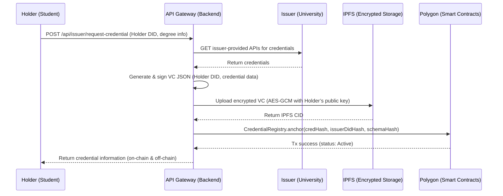

# Zero-Knowledge Credential Verification System on Polygon

## 1. Concepts

### 1.1 Decentralized Identifiers (DIDs)
A Decentralized Identifier (DID) uniquely represents an entity (Issuer, Holder, or Verifier).
Each DID corresponds to a DID Document containing public keys and endpoints for authentication and proof verification.

Example:
```json
{
  "id": "did:polygonid:polygon:amoy:0xabc123...",
  "verificationMethod": [{
    "id": "did:polygonid:polygon:amoy:0xabc123#keys-1",
    "type": "EcdsaSecp256k1VerificationKey2019",
    "controller": "did:polygonid:polygon:amoy:0xabc123...",
    "publicKeyHex": "03d1aef9..."
  }]
}
```

- Issuer DID → The university (trusted credential issuer).
- Holder DID → The student’s identity, managed in a Polygon ID wallet.
- Verifier DID → (Optional) The organization verifying the credential.


### 1.2 Verifiable Credentials (VCs)
A VC is a signed digital credential issued by an Issuer to a Holder’s DID.
It includes claims, such as degree type and graduation date, and the Issuer’s cryptographic signature (VC proof).

```json
{
  "@context": ["https://www.w3.org/2018/credentials/v1"],
  "type": ["VerifiableCredential", "DegreeCredential"],
  "issuer": "did:polygonid:polygon:amoy:0xUni123...",
  "issuanceDate": "2025-06-30T00:00:00Z",
  "credentialSubject": {
    "id": "did:polygonid:polygon:amoy:0xStu456...",
    "degree": "Master",
    "field": "Computer Science"
  },
  "proof": {
    "type": "EcdsaSecp256k1Signature2019",
    "created": "2025-06-30T00:00:00Z",
    "proofPurpose": "assertionMethod",
    "verificationMethod": "did:polygonid:polygon:amoy:0xUni123#keys-1",
    "jws": "eyJhbGciOiJFUzI1NiIs..."
  }
}
```

Note: The `proof` field is the Issuer’s digital signature, proving authenticity. It is not the Holder’s ZK proof.

### 1.3 Zero-Knowledge Proofs (ZKPs)
Later, the Holder generates a ZK proof derived from the VC.
This allows proving statements like *“I have a degree from a valid Issuer”* without revealing personal data.

### 1.4 On-Chain Anchoring
To keep data private:
- Only hashes and statuses are stored on-chain:
  - `credHash = keccak256(vcCanonicalForm)`
  - `issuerDidHash`
  - `schemaHash`
  - status (`Active` / `Revoked`)
- The encrypted VC itself is stored in IPFS (AES-GCM encrypted with the Holder’s public key).

This design ensures public verifiability without leaking sensitive data.

## 2. End-to-End User Stories

### Story 1 — Credential Issuance
1. Holder (student) requests a credential from Issuer (university).
2. Holder retrieves encrypted VC and stores it in their wallet.

### Story 2 — Proof and Verification
1. Holder generates a ZK proof locally using the Polygon ID SDK.
2. Holder encodes the proof in a QR code and shares it with Verifier.
3. Verifier scans the QR, verifies proof off-chain using Polygon ID SDK,
   and checks on-chain credential status.
4. Verifier displays validation result (Valid / Revoked / Expired).


## 3. Smart Contracts

### IssuerRegistry.sol
Registers and manages trusted issuers.

```solidity
contract IssuerRegistry {
    struct Issuer {
        bytes32 didHash;
        address controller;
        string metadataURI;
        bool active;
    }

    mapping(bytes32 => Issuer) public issuers;

    function registerIssuer(bytes32 didHash, address controller, string calldata metadataURI) external;
    function updateIssuer(bytes32 didHash, address controller, string calldata metadataURI, bool active) external;
    function isActive(bytes32 didHash) external view returns (bool);
}
```


### CredentialRegistry.sol
Anchors credential hashes and supports revocation.

```solidity
contract CredentialRegistry {
    enum Status { None, Active, Revoked }

    struct Credential {
        bytes32 credHash;
        bytes32 issuerDidHash;
        bytes32 schemaHash;
        Status status;
    }

    mapping(bytes32 => Credential) public credentials;

    function anchor(bytes32 credHash, bytes32 issuerDidHash, bytes32 schemaHash) external;
    function revoke(bytes32 credHash) external;
    function statusOf(bytes32 credHash) external view returns (Status);
}
```


## 4. Backend (API Gateway)

### 4.1 API Summary

| Method | Endpoint                           | Description                                                                                                                                                    |
| ------ | ---------------------------------- | -------------------------------------------------------------------------------------------------------------------------------------------------------------- |
| `POST` | `/api/issuer/request-credential`   | Synchronous issuance: Holder requests; server calls issuer APIs, builds & signs VC, encrypts+stores to IPFS, anchors on-chain, and returns credential info |
| `GET`  | `/api/holder/credential/:credHash` | Re-fetch encrypted VC (inline or pre-signed URL) for local decryption by Holder                                                                                |
| `GET`  | `/api/credential/status/:credHash` | Public status lookup from chain (Active / Revoked)                                                                                                             |
| `POST` | `/api/verifier/verify-proof`       | *(Optional)* Centralized verification: server validates ZK proof off‑chain + checks chain & issuer allowlist; clients SHOULD verify locally.               |

Notes:
- Issuer‑provided APIs (university data endpoints) are external to this gateway and must be configured per issuer (base URL, auth, mappings).
- Verifier clients SHOULD verify proofs locally (client‑side) using Polygon ID SDK; a server‑side verification API is retained as an optional/centralized policy path.
### 4.2 Sequence Diagram



### 4.3 Auth & Caller Identity
- Transport: HTTPS only
- Authorization & Identification: Each request should be authenticated by DID.
### 4.4 Issuer-Provided APIs (External Connectors)
- Each Issuer must expose read-only endpoints for authoritative degree data (e.g., by `studentId`).
- The API Gateway maintains per‑issuer connector configs (base URL, auth, field mappings).

Example (conceptual, out of scope of this gateway spec):
```
GET https://issuer.example.edu/api/v1/students/{studentId}/degree
Authorization: Bearer <issuer_service_token>
```
### 4.5 Verification Model
- Primary path: Verifier apps verify locally with Polygon ID SDK (no server round‑trip required).
- Server path (optional): `/api/verifier/verify-proof` gives a centralized, policy‑enforced verdict and can offload chain RPCs and issuer‑registry checks.
### 4.7 RESTful API Details
#### `POST /api/issuer/request-credential`
The API gateway:
1) resolves Holder public key from DID;
2) calls issuer-provided APIs to fetch authoritative degree data;
3) builds VC JSON;
4) signs with Issuer’s private key;
5) encrypts VC with Holder’s public key and uploads to IPFS;
6) computes `credHash` and anchors it on-chain;
7) returns consolidated credential metadata to the Holder.

Headers
```
Authorization: Bearer <holder_token>
X-DID: did:polygonid:...Holder...
Content-Type: application/json
```

Request
```json
{
  "holderDid": "did:polygonid:polygon:amoy:0xStu456...",
  "degreeQuery": {
    "studentId": "2025CS123456"
  }
}
```

Response (200 OK)
```json
{
  "status": "issued",
  "credHash": "0xabc123...",
  "ipfsCid": "bafybeigdyr42p...",
  "issuerDid": "did:polygonid:polygon:amoy:0xUni123...",
  "anchoredAtTx": "0xTXHASH...",
  "issuedAt": "2025-10-29T09:00:00Z",
  "schemaHash": "0x123abc..."
}
```

Errors
- `400` invalid DID / malformed request
- `401/403` auth or DID mismatch
- `424` failed to fetch issuer data (issuer APIs unavailable or returned non-authoritative data)
- `502/504` upstream/chain timeouts; client may retry

#### `GET /api/holder/credential/:credHash`
Purpose: Allow the Holder to re-fetch the encrypted VC payload/URL for local decryption.

Headers
```
Authorization: Bearer <holder_token>
X-DID: did:polygonid:...Holder...
```

Response (200 OK)
```json
{
  "credHash": "0xabc123...",
  "ipfsCid": "bafybeigdyr42p...",
  "encryptedVc": "<optional-inline-blob-or-pre-signed-url>",
  "issuerDid": "did:polygonid:polygon:amoy:0xUni123...",
  "schemaHash": "0x123abc..."
}
```

Errors
- `404` unknown `credHash` for this holder
- `403` holder DID mismatch

#### `GET /api/credential/status/:credHash`
Purpose: Public, read-only pass-through to chain for the credential status.

Response
```json
{ "status": "Active" }
```

#### `POST /api/verifier/verify-proof` *(Optional — server-side verification retained)*

Verifier clients SHOULD verify ZK proofs locally with Polygon ID SDK. This endpoint is retained for more complex access control in the future.

Headers
```
Authorization: Bearer <verifier_token or public>
X-DID: did:web:company.com   // Used for more complex access control in the future.
Content-Type: application/json
```

Request
```json
{
  "proof": "<base64 zk proof>",
  "credHash": "0xabc123...",
  "issuerDid": "did:polygonid:polygon:amoy:0xUni123...",
  "verifierDid": "did:web:company.com"
}
```

Server processing
1) Validate ZK proof (off-chain) using Polygon ID verifier SDK.
2) Ensure `issuerDid` is active in IssuerRegistry (on-chain).
3) Ensure `statusOf(credHash)` is `Active` (on-chain).
4) Apply optional policy (e.g., allowed schemas, expiry, nonce binding).

Response
```json
{
  "verified": true,
  "issuer": "did:polygonid:polygon:amoy:0xUni123...",
  "status": "Active",
  "checkedAt": "2025-10-29T09:05:00Z"
}
```

## 5. Client Implementation

Client can be built upon [ether.js](https://docs.ethers.org/v5/).
### 5.1 Holder Client
- Functions:
  1. Manage DID & keys
  2. Store credentials securely
  3. Generate ZK proofs using SDK
  4. Encode proof in QR for Verifier

### 5.2 Verifier Client
- Flow:
  1. Scan QR to retrieve proof JSON
  2. Validate proof locally
  3. Check on-chain status

## 6. ZK Proof Generation and Verification

### 6.1 Proof Generation (Holder)

1. Select VC in wallet
2. Parse Verifier's proof request
3. Locally compute ZK proof
4. Encode proof JSON:
```json
{
  "proof": "<base64 zk proof>",
  "issuerDid": "did:polygonid:polygon:amoy:0xUni123...",
  "credHash": "0xabc...",
  "schemaHash": "0xdef...",
  "timestamp": 1730200000
}
```

### 6.2 Proof Verification (Verifier)

1. Receive proof JSON via QR or link
2. Use SDK to verify
3. Validate Issuer and on-chain credential status
4. Return result
